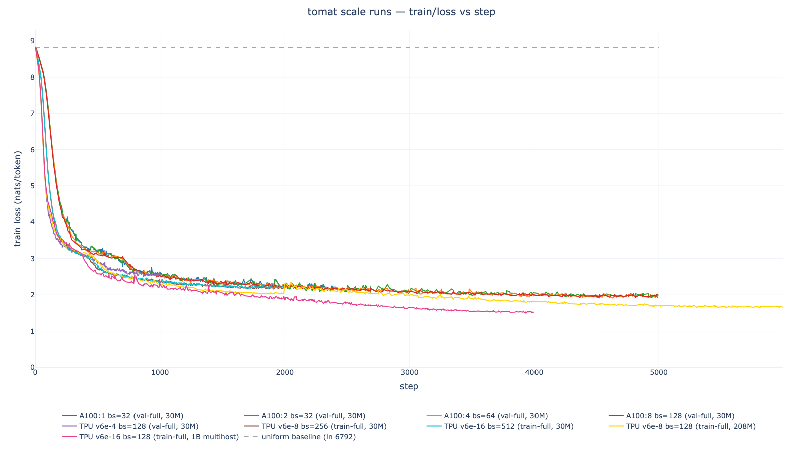

# tomat 🍅

**to**kenized **mat**erials — an LLM/transformer approach to predicting
DFT-converged electron density for periodic crystals. Sibling to
[tomol] (tokenized molecules). Positioned against [electrAI]/RHOAR-Net,
the 3D ResUNet over voxel grids.

**Interactive dashboard**: [tomat.oa.dev](https://tomat.oa.dev) ([source](./site/)).

[electrAI]: https://github.com/Quantum-Accelerators/electrai
[tomol]: https://huggingface.co/ihxds/ToMol-marin-1B

## Patch tokenization

Each training example is one P × P × P sub-cube of a material's
native-resolution density, prefixed with:

- The full grid shape `(nx, ny, nz)`.
- The material's atomic inventory (Z + fractional coordinates).
- The patch's low-corner anchor `(ix, iy, iz)`, its shape `(P, P, P)`,
  and the wrapped **high corner** `(hx, hy, hz) = (ix+P−1) mod nx`. On
  any axis where `hi < lo` the patch crossed a PBC boundary — the model
  sees that as a direct observation rather than having to learn
  modular arithmetic.

At `P = 14` with a 2-token-per-voxel density codec, each sequence is
`14³ × 2 = 5,488` density tokens plus a ~200-token preamble — fits 8k
context with headroom for a 100-atom structure. Vocab is **6,792 tokens**
(18 specials + 118 atomic Z + 1,024 ints + 1,024 position-codec +
4,608 density-codec).

## Example training sequence

Real row from `train-full` — [mp-2282417](https://elvis.oa.dev/?m=mp-2282417)
(Y₃Si₃Ag₃, grid 64×108×108), P=14 patch at offset (5, 9, 44):

```
[BOS]
[GRID_START]   64 108 108                             [GRID_END]
[ATOMS_START]  Y Y Y Si Si Si Ag Ag Ag                [ATOMS_END]
[POS_START]    (p236 p699 p1003  p240 p767 p1005  p0 p512 p768)  …  (+7 more atoms)  [POS_END]
[SHAPE_START]  14 14 14                               [SHAPE_END]
[OFFSET_START] 5 9 44                                 [OFFSET_END]
[HI_START]     18 22 57                               [HI_END]
[DENS_START]   d172 d909  d169 d4175  d168 d525  …  d158 d2204    # 5,488 density tokens = 2 × 14³
[DENS_END]
[EOS]
[PAD] × 2,586                                         # right-padded to 8,192
```

Atom Zs render as element symbols (`Y`, `Si`, `Ag`). Position codec =
3 tokens/coord × 3 coords → 9 tokens/atom. Density codec emits 2 tokens
per voxel. [`scripts/show_tokens.py`](./scripts/show_tokens.py) renders
any parquet row in this form.

## Tokenized datasets

All `two_token_9_12` density codec, P=14, pad_to=8192, seed 42. Full
table + storage layout in [`docs/datasets.md`](./docs/datasets.md).

| label | split | mats | patches/mat | rows | tokens (pad) | on-disk (GCS) |
|---|---|---:|---:|---:|---:|---:|
| `val-smoke` | val | 128 | 32 | 4,096 | 34 M | ~33 MB |
| `val-full` | val | 4,305 | 32 | 137,696 | 1.13 B | 1.49 GB |
| `val-full-m128` | val | 4,305 | 128 | 549,664 | 4.50 B | 1.44 GB |
| **`train-full`** | train | **77,498** | 32 | **2,478,912** | **20.31 B** | **21.1 GB** |

Raw Zarrs live on Princeton della (`/scratch/gpfs/…/rho_gga/`, ~412 GB
total); staged onto two Modal volumes (`tomat-rho-gga` val, 22 GB;
`tomat-rho-gga-train` train, 370 GB) where tokenize runs and emits
parquet, which syncs to `gs://marin-eu-west4/tomat/tokenized/`.

Note on naming: `val-full` is MP's validation split (~4 k mats); we
used it as early compute-scaling training data because it was seeded
to Modal first. `train-full` (77 k mats) is the proper train split.
"4 k mats" / "77 k mats" are the semantic descriptions if the val/train
labels get confusing.

## Scale training runs



Seed 42, 8k context, P=14. A100 runs on val-full ("4 k mats"); TPU
runs on the full train split. Project
[`tomat-two_token_9_12-P14`](https://wandb.ai/PrinceOA/tomat-two_token_9_12-P14).

| run | model | data | compute | batch (per-dev) | steps | tokens | FLOPs (×10¹⁸) | MFU | tok/s | final loss |
|---|---|---|---|---:|---:|---:|---:|---:|---:|---:|
| [A100:1 bs=32](https://wandb.ai/PrinceOA/tomat-two_token_9_12-P14/runs/val-full-5k-bs32-bs32-seed42) | 30M | val-full | Modal A100:1 | 32 (32) | 2,560 / 5k (OOM) | 0.67 B | 0.32 | 12.4% | 80 k | 2.235 |
| [A100:2 bs=32](https://wandb.ai/PrinceOA/tomat-two_token_9_12-P14/runs/val-full-5k-bs32-2gpu-bs32-seed42) | 30M | val-full | Modal A100:2 | 32 (16) | 5,000 | 1.31 B | 0.62 | 12.0% | 157 k | **1.962** |
| [A100:4 bs=64](https://wandb.ai/PrinceOA/tomat-two_token_9_12-P14/runs/val-full-5k-bs64-4gpu-bs64-seed42) | 30M | val-full | Modal A100:4 | 64 (16) | 5,000 | 2.62 B | 1.25 | 11.96% | 313 k | 1.975 |
| [A100:8 bs=128](https://wandb.ai/PrinceOA/tomat-two_token_9_12-P14/runs/val-full-5k-bs128-8gpu-bs128-seed42) | 30M | val-full | Modal A100:8 | 128 (16) | 5,000 | 5.24 B | 2.49 | 11.86% | 624 k | 2.022 |
| [TPU v6e-4 bs=128](https://wandb.ai/PrinceOA/tomat-two_token_9_12-P14/runs/val-full-tpu-bs128-seed42) | 30M | val-full | Marin TPU v6e-4 | 128 (32) | 1,000 | 1.05 B | 0.50 | 10.25% | 792 k | 2.620 |
| [**TPU v6e-8 bs=256**](https://wandb.ai/PrinceOA/tomat-two_token_9_12-P14/runs/train-full-tpu8-bs256-seed42) | 30M | **train-full** | Marin TPU v6e-8 | 256 (32) | 2,000 | **4.19 B** | **2.00** | 8.38% | 1,297 k | **2.214** |
| [**TPU v6e-16 bs=512** (multihost)](https://wandb.ai/PrinceOA/tomat-two_token_9_12-P14/runs/train-full-tpu16-30M-bs512-seed42) | 30M | train-full | Marin TPU v6e-16 (4 VMs) | 512 (32) | 2,000 | **8.39 B** | **4.00** | 6.6% | **1,983 k** | **2.212** |
| [**TPU v6e-8 bs=128** (+ val, bf16)](https://wandb.ai/PrinceOA/tomat-two_token_9_12-P14/runs/train-full-tpu8-200M-bs128-val-bf16-seed42) | **208M** | train-full | Marin TPU v6e-8 | 128 (16) | 2,000 | 2.10 B | **5.18** | 9.88% | 294 k | **2.060** |

Headlines:

- **A100 scaling is linear**: 157 k → 313 k → 624 k tok/s across A100:2/4/8
  at per-device bs=16 (2× per doubling, MFU flat ~12%).
- **TPU v6e-4 ≈ 10× A100:1 tok/s** at the same per-device batch — matching
  the 12× hardware-FLOPs ratio minus a ~17% MFU gap.
- **train-full** (18× more data): loss drops 2.62 → 2.21, but the 30M
  model is now **~7× past Chinchilla-optimal** so it's parameter-bound,
  not data-bound. Bigger model is the next axis.
- **Multihost TPU (v6e-16) works**: 4 VMs × 4 chips, 1.98 M tok/s at
  ~78% scaling efficiency vs v6e-8. Required adding
  `jax.distributed.initialize()` at script entry because Levanter's
  `WandbConfig.init` calls a multihost broadcast before the trainer's
  own distributed setup fires.
- **208M Qwen3** (hidden=1024, 12 layers, 16 heads, bf16, with real
  val split) on the same train-full finished at **loss 2.060 on 2.1 B
  tokens** — 0.15 nats below the 30 M baseline at roughly half the
  tokens. Still ~7× param-bound for 2 B tokens, so the next axis is
  another parameter jump + more tokens.

## Running

Python (tokenize + training):

```bash
spd                                 # direnv + versioned venv
uv sync                             # install deps
uv run pytest tests/                # tokenizer roundtrip tests
```

Modal-side tokenize (laptop → Modal A100 volume → GCS):

```bash
TOMAT_VOLUME=tomat-rho-gga modal run \
  scripts/tokenize_patches_modal.py::parallel \
  --label val-full --split validation --n-workers 16
```

Marin/TPU training (from `marin/`):

```bash
cd marin
uv run iris --cluster=marin job run \
  --tpu v6e-8 --enable-extra-resources --cpu 32 --memory 64GB \
  --env-vars WANDB_API_KEY "$WANDB_API_KEY" \
  --env-vars TOMAT_LABEL train-full --env-vars TOMAT_MODEL 30M \
  -- python train_tomat_tpu.py
```

Env-var knobs on the TPU script: `TOMAT_LABEL`, `TOMAT_STEPS`,
`TOMAT_BATCH_SIZE`, `TOMAT_SEED`, `TOMAT_MODEL` (`30M` or `200M`),
`TOMAT_VAL_SEQS`, `TOMAT_RESULTS_LABEL`.

Static-PNG plot regeneration: `scripts/make_scaling_plot_png.py`. Data
pull from W&B: `scripts/pull_wandb_runs.py`. Token-row decoder:
`scripts/show_tokens.py`.

## Layout

```
src/tomat/
  float_codec.py                 # FP16-like log-uniform codec (3 tokens per signed float)
  promolecule.py                 # analytic atomic-density models (Δρ subtraction; scheme 4)
  tokenizers/
    patch.py                     # patch tokenizer (the one used for training)
    base.py, direct.py,          # earlier fidelity-sweep tokenizers (schemes 1/3/5)
    cutoff.py, fourier*.py, delta.py
  data/
    mp.py                        # S3 → pymatgen Chgcar, local caching
    zarr_io.py                   # Zarr → density array (from della/Modal volume)
    classify.py                  # material-type classifier
scripts/
  tokenize_patches*.py           # patch tokenizer + Modal parallel wrapper
  train_smoke_modal.py           # Modal A100 training (A100:{1,2,4,8} variants)
  fidelity_sweep*.py, fit_*.py   # earlier fidelity-sweep entry points
  show_tokens.py                 # decode a parquet row to human-readable form
  sync_parquets_to_gcs.py        # Modal-vol → GCS upload with md5 verify
  pull_wandb_runs.py             # W&B → CSV dump for plots
  make_scaling_plot_png.py       # static scaling-loss PNG for README / slides
  verify_val_full_parquet.py     # Modal-side row-group integrity scan
marin/
  train_tomat_tpu.py             # TPU training script (v6e-4/8/16, 30M/200M, bf16, val)
  pyproject.toml, uv.lock        # marin-community find-links + TPU-gated jax
docs/
  datasets.md                    # raw Zarr layout, tokenized sets, scale-runs table
site/                            # React + Plotly interactive dashboard (tomat.oa.dev)
specs/
  00..09-*.md                    # design / project / spec documents
```

## Follow-ups

- Scale model further (600M–1B) now that 208M cleared the 30M baseline.
- DVX-track raw Zarrs + parquet manifests (spec 09, della-side).
- TransformerEngine on Modal A100:4 for the bs=128 apples-to-apples
  GPU point (currently limited to per-device bs=16 due to attention
  OOM; spec / post-meeting).

## Earlier work

For the pre-training fidelity sweep (NMAE / χ² reconstruction floors
across cutoff/Fourier/Δρ tokenizers), see
[`specs/done/02-fidelity-sweep.md`](./specs/done/02-fidelity-sweep.md)
and [`results/sweep-n50.csv`](./results/sweep-n50.csv). Headline from
that phase: Fourier lowpass beats voxel cutoff by ~2 orders of magnitude
on NMAE at every sparsity; direct-float Fourier encoding needs ≥64 k
context to get in budget → patches (what we train on today) were the
right answer.
