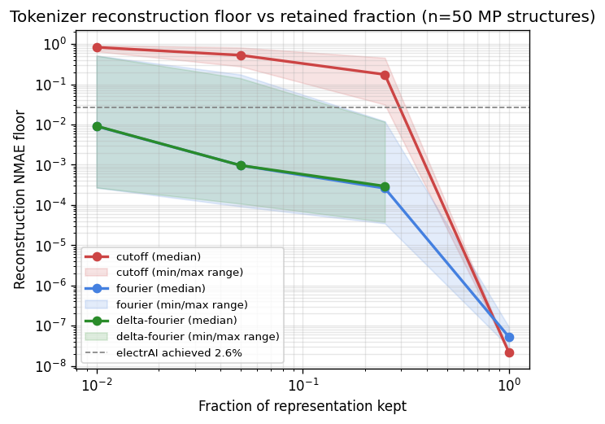
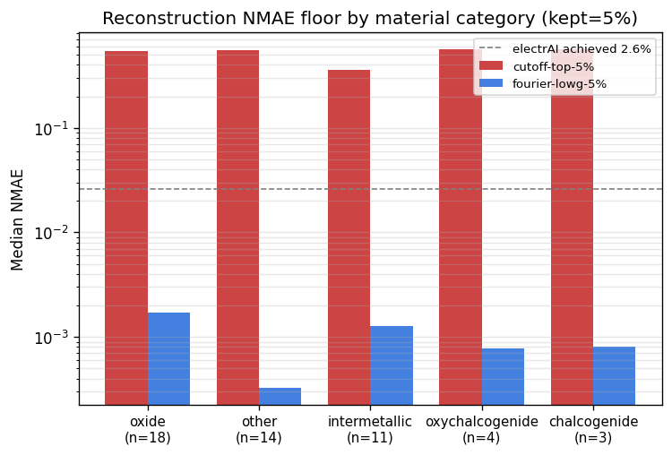
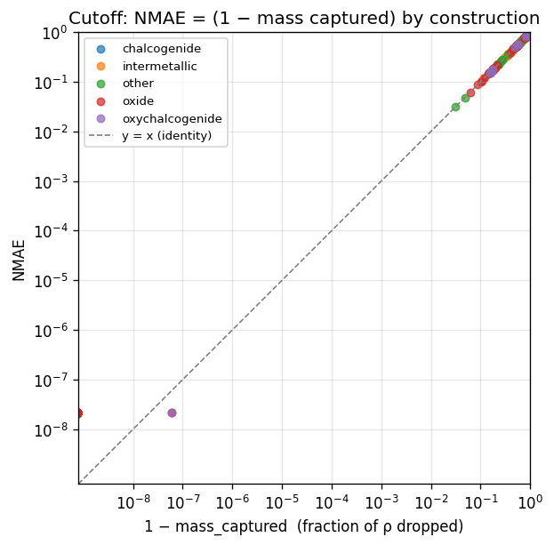

# tomat 🍅
**to**kenized **mat**erials; LLM/transformer-based approach to predicting DFT-converged electron density for periodic crystals.

Uses a sequence model over a tokenized representation of $ρ$ (contrast with [electrAI]'s 3D ResUNet over voxel grids).

Sibling to [tomol] (**to**kenized **mo**lecules, Will Held's OMol25 S2EF
work). See [`specs/00-project-context.md`](./specs/00-project-context.md)
for positioning and the tomol/electrAI relationship.

**Interactive plots:** [tomat.oa.dev](https://tomat.oa.dev) ([source](./site/)).

[electrAI]: https://github.com/Quantum-Accelerators/electrai
[tomol]: https://huggingface.co/ihxds/ToMol-marin-1B

## Status

Very early. Repo exists to characterize the **reconstruction-error floor**
of candidate tokenization schemes before committing to training — the
transformer's achievable NMAE is bounded below by how much information
each scheme throws away on encode/decode.

Seven candidate schemes are enumerated in
[`specs/01-tokenization-strategies.md`](./specs/01-tokenization-strategies.md).
Three of the seven ("the easy three" — no trained VQ-VAE, no basis
choice, no RI-fitting step) are implemented so far.

## Preliminary results

**Data:** the electrAI-curated 2,885-entry MP subset on S3
(`s3://openathena/electrai/mp/chg_datasets/dataset_4/label/`), 128³
voxel grids. `label/` = DFT-converged ρ (the thing we want to tokenize).

**Metric:** NMAE = `sum(|ρ_reconstructed − ρ_original|) / sum(|ρ_original|)`
— the same metric electrAI uses, for apples-to-apples comparison.

What the sweep measures is the tokenizer's **reconstruction floor** — the
NMAE from `encode → decode` alone, with no model in the loop. The
transformer's total error on the same metric will be `floor +
prediction_error`.

**Reference point.** electrAI (recently rebranded RHOAR-Net; "Rho
Augmented Resolution Network") is OA's in-house 3D ResUNet, and the
stepping-stone target tomat is trying to match at comparable compute.
On the same MP subset used here, electrAI's best reported validation
NMAE is **2.60%** (Jan 2026 monthly review, 100-epoch run; 50-epoch
runs cluster around 2.7–3.1% and were "still learning").

For tomat to *beat* electrAI on NMAE, the tokenizer floor needs to be
well below 2.6%, leaving headroom for the transformer to add some
prediction error. A floor approaching 2.6% is disqualifying; a floor
well below is a *prerequisite* to competing, not an achievement.

**Caveat on the metric itself.** electrAI's own Jan 2026 review surfaces
a concern (Yael's investigation) that MAE/NMAE is dominated by
high-density regions — voxels near nuclei where ρ is ~e+02 — while
chemically interesting signal (bonds, charge transfer) lives at much
lower density. Across loss functions, the ratio of low- to
high-density error contribution varies from ~0.005 (MAE) to ~15
(Chi-Squared). A scheme that "beats 2.6% NMAE" while discarding
low-density information may be winning the metric but losing the science.

The fidelity sweep now reports NMAE, χ² (low-ρ-weighted), Hellinger,
JSD, and Weighted MAE in each row of [`results/sweep-n50.csv`](./results/sweep-n50.csv);
the tables below show NMAE + χ² side-by-side so the divergence between
"whole-density error" and "low-density-weighted error" is visible at a
glance. Full breakdowns available via
`uv run scripts/summarize_sweep.py results/sweep-n50.csv`.

**Schemes:**

| scheme | implementation | what's kept | what's dropped |
|---|---|---|---|
| 1 — direct | `DirectTokenizer` | float32 copy of the density grid | nothing (sanity-check baseline) |
| 3 — voxel cutoff | `CutoffTokenizer` | top-K% voxels ranked by density value | all other voxels are zeroed |
| 5 — Fourier lowpass | `FourierTokenizer` | lowest-K% FFT coefficients by \|G\| | high-frequency modes |

### Tables

Auto-regenerated via [`mdcmd`][mdcmd] from [`results/sweep-n50.csv`](./results/sweep-n50.csv).

<!-- `uv run scripts/summarize_sweep.py results/sweep-n50.csv -m nmae -m chi_sq --html` -->
<details open><summary>Fidelity-sweep tables</summary>

### Overall (n=50, 128³ grid)

| config | mean NMAE | mean χ² | mean mass captured |
|---|---:|---:|---:|
| `direct` | 2.15e-08 | 6.38e-16 | — |
| `direct-coded` | 6.24e-07 | 1.60e-12 | — |
| `cutoff-top-1pct` | 8.04e-01 | 8.04e-01 | 0.196 |
| `cutoff-top-5pct` | 5.01e-01 | 5.01e-01 | 0.499 |
| `cutoff-top-25pct` | 1.77e-01 | 1.77e-01 | 0.823 |
| `cutoff-top-100pct` | 2.15e-08 | 6.38e-16 | 1.000 |
| `fourier-lowg-0.25pct` | 1.68e-01 | 2.06e+01 | — |
| `fourier-coded-lowg-0.25pct` | 1.68e-01 | 2.06e+01 | — |
| `fourier-lowg-0.5pct` | 9.08e-02 | 8.30e+00 | — |
| `fourier-coded-lowg-0.5pct` | 9.08e-02 | 8.30e+00 | — |
| `fourier-lowg-1pct` | 4.78e-02 | 8.21e-01 | — |
| `fourier-coded-lowg-1pct` | 4.78e-02 | 8.21e-01 | — |
| `fourier-lowg-5pct` | 9.16e-03 | 1.25e-02 | — |
| `fourier-coded-lowg-5pct` | 9.16e-03 | 1.25e-02 | — |
| `fourier-lowg-25pct` | 9.08e-04 | 5.90e-05 | — |
| `fourier-coded-lowg-25pct` | 9.08e-04 | 5.90e-05 | — |
| `fourier-lowg-100pct` | 5.40e-08 | 1.08e-12 | — |
| `fourier-coded-lowg-100pct` | 2.79e-06 | 8.39e-10 | — |
| `delta-fourier-lowg-0.25pct` | 1.13e-01 | 3.66e-01 | — |
| `delta-fourier-coded-lowg-0.25pct` | 1.13e-01 | 3.66e-01 | — |
| `delta-fourier-lowg-0.5pct` | 6.44e-02 | 3.62e-01 | — |
| `delta-fourier-coded-lowg-0.5pct` | 6.44e-02 | 3.62e-01 | — |
| `delta-fourier-lowg-1pct` | 4.20e-02 | 2.43e-01 | — |
| `delta-fourier-coded-lowg-1pct` | 4.20e-02 | 2.43e-01 | — |
| `delta-fourier-lowg-5pct` | 1.47e-02 | 1.49e-01 | — |
| `delta-fourier-coded-lowg-5pct` | 1.47e-02 | 1.49e-01 | — |
| `delta-fourier-lowg-25pct` | 3.85e-03 | 3.10e-02 | — |
| `delta-fourier-coded-lowg-25pct` | 3.85e-03 | 3.10e-02 | — |

### NMAE by material category (mean)

| config | oxide (n=18) | other (n=14) | intermetallic (n=11) | oxychalcogenide (n=4) | chalcogenide (n=3) |
|---|:---:|:---:|:---:|:---:|:---:|
| `direct` | 2.15e-08 | 2.15e-08 | 2.12e-08 | 2.15e-08 | 2.17e-08 |
| `direct-coded` | 6.24e-07 | 6.24e-07 | 6.24e-07 | 6.24e-07 | 6.22e-07 |
| `cutoff-top-1pct` | 8.31e-01 | 8.26e-01 | 7.14e-01 | 8.48e-01 | 8.03e-01 |
| `cutoff-top-5pct` | 5.24e-01 | 5.53e-01 | 3.68e-01 | 5.50e-01 | 5.52e-01 |
| `cutoff-top-25pct` | 1.50e-01 | 2.03e-01 | 1.93e-01 | 1.62e-01 | 1.77e-01 |
| `cutoff-top-100pct` | 2.15e-08 | 2.15e-08 | 2.12e-08 | 2.15e-08 | 2.17e-08 |
| `fourier-lowg-0.25pct` | 2.96e-01 | 4.46e-02 | 1.80e-01 | 8.56e-02 | 4.90e-02 |
| `fourier-coded-lowg-0.25pct` | 2.96e-01 | 4.46e-02 | 1.80e-01 | 8.56e-02 | 4.90e-02 |
| `fourier-lowg-0.5pct` | 1.89e-01 | 1.56e-02 | 6.85e-02 | 3.07e-02 | 1.65e-02 |
| `fourier-coded-lowg-0.5pct` | 1.89e-01 | 1.56e-02 | 6.85e-02 | 3.07e-02 | 1.65e-02 |
| `fourier-lowg-1pct` | 1.13e-01 | 5.52e-03 | 1.91e-02 | 1.12e-02 | 5.18e-03 |
| `fourier-coded-lowg-1pct` | 1.13e-01 | 5.52e-03 | 1.91e-02 | 1.12e-02 | 5.18e-03 |
| `fourier-lowg-5pct` | 2.37e-02 | 4.23e-04 | 1.85e-03 | 1.01e-03 | 6.88e-04 |
| `fourier-coded-lowg-5pct` | 2.37e-02 | 4.23e-04 | 1.85e-03 | 1.01e-03 | 6.88e-04 |
| `fourier-lowg-25pct` | 2.01e-03 | 1.30e-04 | 4.96e-04 | 2.49e-04 | 3.35e-04 |
| `fourier-coded-lowg-25pct` | 2.01e-03 | 1.30e-04 | 4.96e-04 | 2.49e-04 | 3.35e-04 |
| `fourier-lowg-100pct` | 4.81e-08 | 5.07e-08 | 7.12e-08 | 4.96e-08 | 4.85e-08 |
| `fourier-coded-lowg-100pct` | 2.69e-06 | 2.59e-06 | 3.30e-06 | 2.64e-06 | 2.67e-06 |
| `delta-fourier-lowg-0.25pct` | 1.47e-01 | 4.23e-02 | 1.80e-01 | 6.86e-02 | 4.73e-02 |
| `delta-fourier-coded-lowg-0.25pct` | 1.47e-01 | 4.23e-02 | 1.80e-01 | 6.86e-02 | 4.73e-02 |
| `delta-fourier-lowg-0.5pct` | 1.07e-01 | 1.77e-02 | 6.89e-02 | 5.63e-02 | 2.23e-02 |
| `delta-fourier-coded-lowg-0.5pct` | 1.07e-01 | 1.77e-02 | 6.89e-02 | 5.63e-02 | 2.23e-02 |
| `delta-fourier-lowg-1pct` | 8.57e-02 | 9.50e-03 | 1.99e-02 | 4.32e-02 | 1.10e-02 |
| `delta-fourier-coded-lowg-1pct` | 8.57e-02 | 9.50e-03 | 1.99e-02 | 4.32e-02 | 1.10e-02 |
| `delta-fourier-lowg-5pct` | 3.41e-02 | 2.24e-03 | 2.89e-03 | 1.26e-02 | 1.84e-03 |
| `delta-fourier-coded-lowg-5pct` | 3.41e-02 | 2.24e-03 | 2.89e-03 | 1.26e-02 | 1.84e-03 |
| `delta-fourier-lowg-25pct` | 9.01e-03 | 5.86e-04 | 1.29e-03 | 1.58e-03 | 4.59e-04 |
| `delta-fourier-coded-lowg-25pct` | 9.01e-03 | 5.86e-04 | 1.29e-03 | 1.58e-03 | 4.59e-04 |

### χ² by material category (mean)

| config | oxide (n=18) | other (n=14) | intermetallic (n=11) | oxychalcogenide (n=4) | chalcogenide (n=3) |
|---|:---:|:---:|:---:|:---:|:---:|
| `direct` | 6.41e-16 | 6.42e-16 | 6.24e-16 | 6.40e-16 | 6.54e-16 |
| `direct-coded` | 3.53e-12 | 5.19e-13 | 5.19e-13 | 5.19e-13 | 5.17e-13 |
| `cutoff-top-1pct` | 8.31e-01 | 8.26e-01 | 7.14e-01 | 8.48e-01 | 8.03e-01 |
| `cutoff-top-5pct` | 5.24e-01 | 5.53e-01 | 3.68e-01 | 5.50e-01 | 5.52e-01 |
| `cutoff-top-25pct` | 1.50e-01 | 2.03e-01 | 1.93e-01 | 1.62e-01 | 1.77e-01 |
| `cutoff-top-100pct` | 6.41e-16 | 6.42e-16 | 6.24e-16 | 6.40e-16 | 6.54e-16 |
| `fourier-lowg-0.25pct` | 5.70e+01 | 4.40e-02 | 2.15e-01 | 8.63e-02 | 1.70e-02 |
| `fourier-coded-lowg-0.25pct` | 5.70e+01 | 4.40e-02 | 2.15e-01 | 8.63e-02 | 1.70e-02 |
| `fourier-lowg-0.5pct` | 2.30e+01 | 1.61e-02 | 4.72e-02 | 1.36e-02 | 2.26e-03 |
| `fourier-coded-lowg-0.5pct` | 2.30e+01 | 1.61e-02 | 4.72e-02 | 1.36e-02 | 2.26e-03 |
| `fourier-lowg-1pct` | 2.27e+00 | 2.56e-03 | 6.36e-03 | 1.23e-03 | 2.34e-04 |
| `fourier-coded-lowg-1pct` | 2.27e+00 | 2.56e-03 | 6.36e-03 | 1.23e-03 | 2.34e-04 |
| `fourier-lowg-5pct` | 3.47e-02 | 2.01e-06 | 3.83e-05 | 1.56e-05 | 2.89e-06 |
| `fourier-coded-lowg-5pct` | 3.47e-02 | 2.01e-06 | 3.83e-05 | 1.56e-05 | 2.89e-06 |
| `fourier-lowg-25pct` | 1.63e-04 | 1.21e-07 | 1.52e-06 | 2.12e-07 | 5.79e-07 |
| `fourier-coded-lowg-25pct` | 1.63e-04 | 1.21e-07 | 1.52e-06 | 2.12e-07 | 5.79e-07 |
| `fourier-lowg-100pct` | 2.84e-12 | 1.53e-13 | 3.00e-14 | 3.45e-14 | 2.25e-14 |
| `fourier-coded-lowg-100pct` | 2.17e-09 | 1.57e-10 | 3.57e-11 | 4.42e-11 | 2.81e-11 |
| `delta-fourier-lowg-0.25pct` | 8.59e-01 | 2.29e-02 | 2.15e-01 | 2.09e-02 | 1.57e-02 |
| `delta-fourier-coded-lowg-0.25pct` | 8.59e-01 | 2.29e-02 | 2.15e-01 | 2.09e-02 | 1.57e-02 |
| `delta-fourier-lowg-0.5pct` | 9.64e-01 | 8.74e-03 | 4.71e-02 | 1.71e-02 | 3.29e-03 |
| `delta-fourier-coded-lowg-0.5pct` | 9.64e-01 | 8.74e-03 | 4.71e-02 | 1.71e-02 | 3.29e-03 |
| `delta-fourier-lowg-1pct` | 6.65e-01 | 3.61e-03 | 6.44e-03 | 1.14e-02 | 8.32e-04 |
| `delta-fourier-coded-lowg-1pct` | 6.65e-01 | 3.61e-03 | 6.44e-03 | 1.14e-02 | 8.32e-04 |
| `delta-fourier-lowg-5pct` | 4.13e-01 | 2.90e-04 | 8.15e-05 | 1.89e-03 | 2.61e-05 |
| `delta-fourier-coded-lowg-5pct` | 4.13e-01 | 2.90e-04 | 8.15e-05 | 1.89e-03 | 2.61e-05 |
| `delta-fourier-lowg-25pct` | 8.60e-02 | 8.46e-06 | 1.47e-05 | 5.19e-05 | 1.27e-06 |
| `delta-fourier-coded-lowg-25pct` | 8.60e-02 | 8.46e-06 | 1.47e-05 | 5.19e-05 | 1.27e-06 |

</details>

[mdcmd]: https://pypi.org/project/mdcmd/

### Commentary

Cutoff NMAE matches `1 − mass_captured` exactly by construction — dropped voxels contribute their full density to the error. So $\mathrm{NMAE}_\mathrm{floor}(\text{cutoff-top-}X) = 1 − \text{mass}_\text{top-}X$, and for this dataset the top 5% of voxels carries only ~50% of total integrated density. The remaining ~50% lives in the long mid/low-$ρ$ tail — which is why top-$K$ cutoff can't be competitive on NMAE without keeping nearly all voxels.

**Δρ with a multi-shell Slater promolecule density**
(`MultiShellSlaterPromolecule`, valence-only, via Slater's-rule Z_eff)
behaves differently across metrics and sparsity regimes:

* **At aggressive compression (≤ 1% coefs)**: Δρ helps modestly on NMAE
  (1%: 4.78e-2 → 4.20e-2, ~12% better) and more strongly on χ² (1%:
  8.21e-1 → 2.43e-1, **~70% better**). Δρ's win is larger on the
  metric that rewards low-ρ accuracy — exactly Yael's point that
  NMAE under-credits chemistry.
* **At high fidelity (5–25% coefs)**: Δρ *loses* on both metrics
  (5% NMAE: 9.16e-3 → 1.47e-2; 5% χ²: 1.25e-2 → 1.49e-1). Our analytic
  promolecule doesn't perfectly match VASP's pseudopotential valence
  density, so residual promolecule error dominates when the Fourier
  compression is no longer the bottleneck.
* **Oxide-specific picture**: at 1% NMAE we see 11.3% → 8.6% (~24%
  better); χ² goes from 2.27 (oxide) → 0.67 (Δρ). Directional
  confirmation that removing the atomic-core content helps oxides
  most — but our promolecule is still an all-electron Slater
  approximation, not POTCAR-matched.

**Implication**: Δρ's fundamental value depends on how well the
promolecule density matches the VASP-PAW conventions the CHGCARs
follow. A POTCAR-derived pseudo-valence model would likely amplify both
the aggressive-compression win and the high-fidelity regression, since
it would match the data's conventions exactly. That's one next step
for `scheme 4`.

> **Note on terminology**: the local term "promolecule density" refers
> to the chemistry-standard $\sum_\text{atoms}\rho_\text{atom}(r-R)$
> (a.k.a. Independent Atom Model). *Not to be confused with OA's
> PADS — Pre-tabulated Atomic Density Superposition — which is a
> VASP-derived tabulated density used by RHOAR-Net to generate
> low-resolution **inputs** without a VASP license at inference, a
> different use case.*

### Plots







Regenerate via `uv run scripts/plot_sweep.py results/sweep-n50.csv` (or
`dvx run` for the full provenance chain).

### Observations (n=50, preliminary)

**Budget framing.** We want `floor + prediction_error < 0.026`. The floor
is what the sweep measures; prediction error is the work the transformer
has to do. Lower floor = more budget for the model to be imperfect.

**Context-length feasibility.** With tomol-style SE/M0/M1 float encoding
(3 tokens per real value, 6 tokens per complex Fourier coef), Marin's
standard 4k/16k context windows fit:

| target seq len | Fourier fraction (direct float encoding) | median NMAE | viable? |
|---|:---:|:---:|:---:|
| 4k | ≤ 0.06% | — (not measured; worse than 0.25%) | no |
| 16k | ≤ 0.25% | 8.9% | **no** — already ~3× over electrAI budget |
| 64k | ≤ 1% | 0.9% | yes on median; oxide tail (mean 4.8%) tight |
| 256k+ | 5% | 0.10% | yes, comfortable; expensive |

**Direct-float Fourier encoding needs ≥64k context to be in budget**, and
even then oxides are borderline. For the usual 4–16k regime, **VQ or
patching is required**, not optional — this rules out naive
tokenize-and-train.

* **Fourier dominates voxel-cutoff at every sparsity level by ~2 orders
  of magnitude.** The chemically-interesting information lives in the
  low-spatial-frequency modes, not in the top-density voxels (which are
  concentrated near nuclei and don't carry bond/charge-transfer signal).
* **Cutoff (scheme 3) is a non-starter as-is.** At 25% of voxels it's
  still at 18% NMAE — already 7× over electrai's achieved loss before
  any model is trained. The rank-by-density criterion is backwards for
  this task: top-density voxels are near nuclei and trivially
  reconstructible from atomic positions, so the scheme is keeping the
  easy part and throwing away the hard part.
* **Fourier's budget at 5% coefs is comfortable in the median case
  (~2.5% budget) but tight in mean** (1.7% budget) — and is already
  *negative* for oxides in the mean (floor 2.4% vs target 2.6%, leaving
  ~0.2% budget for the transformer). Oxides at 1% coefs blow the budget
  outright (floor 11.3%).
* **Oxides are the worst case for Fourier**, 10–50× worse than every
  other category. Most likely the compact O core has non-negligible
  power at high \|G\|, so the lowpass leaves a residual. This is a
  concrete argument for **scheme 4 (Δρ)** next: subtracting a
  promolecule density removes the atomic-core contribution and should
  flatten the category gap.
* **Dataset skew caveat:** the electrai-curated 2,885-subset has no
  halides or oxyhalides in the first n=50 (alphabetical by mp-id).
  Per the design doc's sparsity table, halides are the sparsest class
  and the one cutoff was originally motivated by — so cutoff may look
  relatively better if we re-run on a stratified sample. Doesn't change
  the headline (cutoff 18% at 25% kept is catastrophic), but worth
  confirming.

Raw CSV in [`results/sweep-n50.csv`](./results/sweep-n50.csv); regenerate
tables with `uv run scripts/summarize_sweep.py results/sweep-n50.csv`. See
[`specs/02-fidelity-sweep.md`](./specs/02-fidelity-sweep.md) for scope
notes and follow-ups.

## Running

```bash
spd                                            # project + venv setup
uv sync                                        # install deps
uv run pytest tests/                           # 17 tokenizer tests (no S3 IO)
uv run scripts/fidelity_sweep.py -n 10         # quick smoke test
uv run scripts/fidelity_sweep.py -n 50 -o tmp/sweep-n50.csv
```

CHGCARs are ~73 MB each. The first run against a given mp-id downloads
from S3 to `data/mp-cache/`; subsequent runs are local.

## Layout

```
pyproject.toml            # deps: pymatgen, numpy, click (marin stack deferred)
src/tomat/
  float_codec.py          # FP16-like log-uniform codec (3 tokens per signed float)
  promolecule.py          # analytic atomic-density models for Δρ subtraction
  token_count.py          # per-scheme token accounting (assumes codec fidelity)
  tokenizers/
    base.py               # DensityTokenizer ABC (encode → decode → roundtrip)
    direct.py             # scheme 1 (float32 baseline)
    direct_coded.py       # scheme 1 with FP16 codec
    cutoff.py             # scheme 3
    fourier.py            # scheme 5 (complex coefs, native precision)
    fourier_coded.py      # scheme 5 with FP16 codec on real+imag
    delta.py              # scheme 4 (Δρ = ρ − ρ_promolecule) — wraps any base
  data/
    mp.py                 # S3 → pymatgen Chgcar, local caching
    classify.py           # material-type classifier (halide/oxide/intermetallic/...)
configs/
  fp16-channels.json      # codec (log_min, log_max) per channel
scripts/
  fidelity_sweep.py       # tokenize → detokenize → NMAE, per-scheme CSV output
  fit_density_codec.py    # fit codec ranges from cached CHGCARs
  summarize_sweep.py      # markdown tables from the sweep CSV
  plot_sweep.py           # matplotlib plots
specs/
  00-project-context.md   # positioning, sibling-project notes, open questions
  01-tokenization-strategies.md  # the 7 candidate schemes + tradeoffs
  02-fidelity-sweep.md    # this sweep's plan + current results
site/                     # React + Plotly interactive dashboard (tomat.oa.dev)
tests/
  test_tokenizers.py      # roundtrip tests on synthetic densities (no IO)
  test_float_codec.py     # codec precision / clamping / zero-handling
```

## Follow-ups

- Train a tiny Qwen3 on downsampled-grid direct-coded tokens as an
  end-to-end plumbing test (priority; accuracy secondary).
- Patch-based tokenization (ViT-style): each voxel patch → one token,
  or hierarchical / adaptive refinement.
- Copy grug's `launch.py`/`model.py`/`train.py` from
  `marin/experiments/grug/base/` and wire against the chosen tokenizer
  output — the training entrypoint.
- Implement scheme 2 (VQ-VAE) — learned compression of density patches
  to discrete tokens; unblocks 4k/16k context windows.
- Implement schemes 6 (SH) and 7 (Gaussian / RI) only if the real-space
  schemes hit a fidelity floor above electrAI's ~2.6% NMAE.
