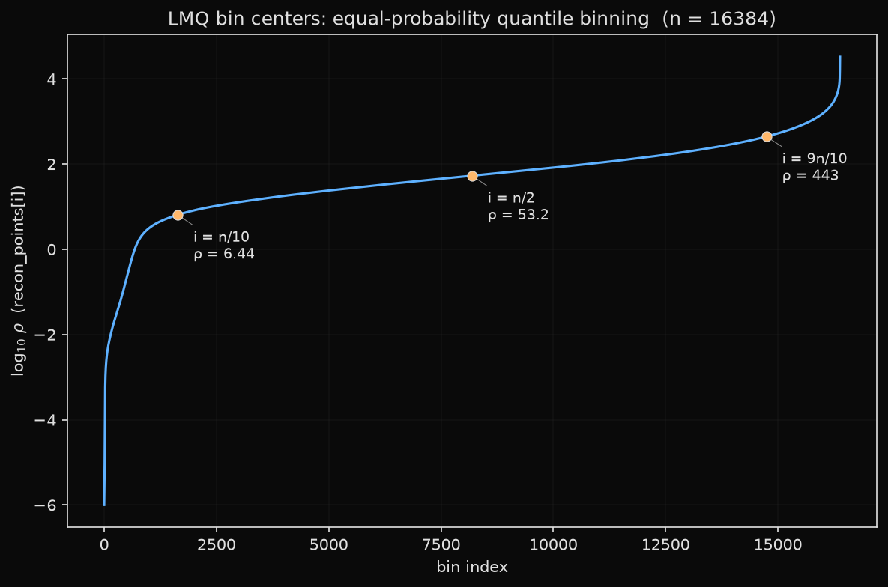
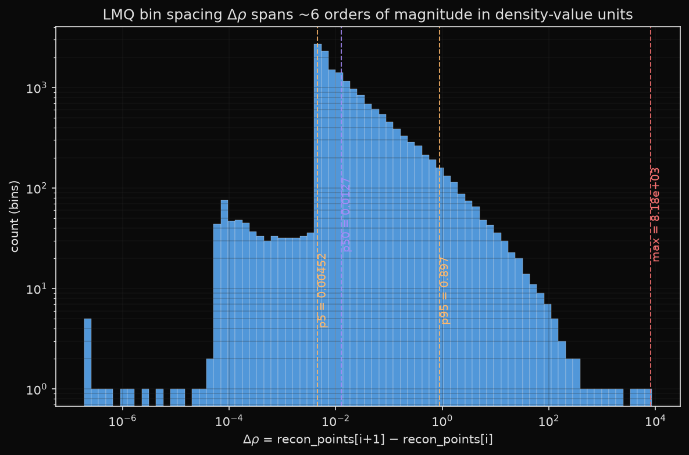
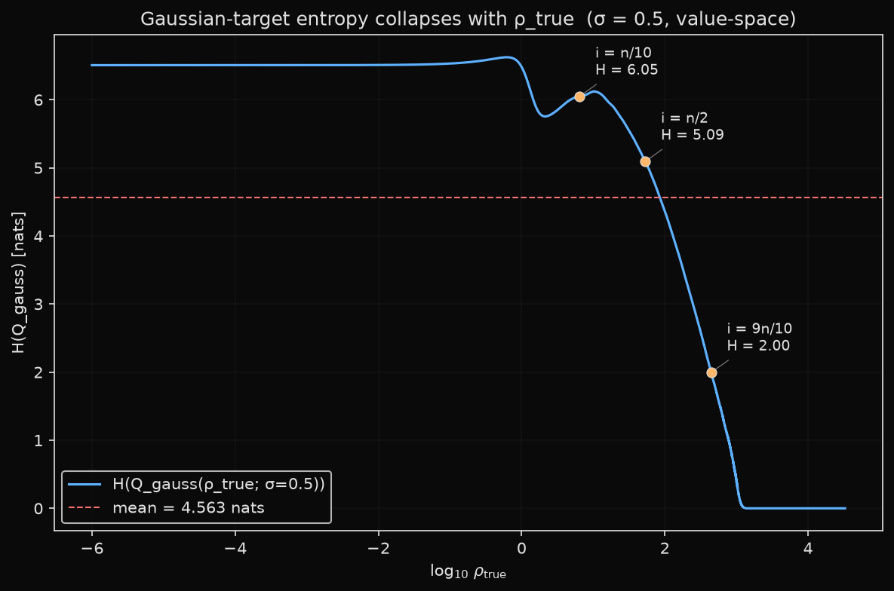

# Codec and tokenization design: LMQ

**Status**: drafted 2026-06-10

> Plots in this post are generated by [`scripts/analyze_lmq_codec.py`][script]
> against the live `lmq-v2-16k.npz` codec.
>
> [script]: ../scripts/analyze_lmq_codec.py

---

## Setup

Charge density prediction requires mapping continuous scalar fields ρ(x,y,z) ≥ 0
into a discrete token vocabulary a language model can predict. The Materials
Project's GGA charge densities span roughly six orders of magnitude (vacuum ~0,
atom cores ~10³–10⁴ e/ų), with a strongly skewed distribution: most voxels
are near-zero, a small fraction are high-density atom cores.

Early tokenization used a `two_token_9_12` codec: each density float was encoded
as two tokens — a 9-bit log-magnitude bin (512 vocab) and a 12-bit fine
position within that bin (4096 vocab) — for a combined 21-bit log-uniform
discretization. Total density vocab: 4,608 tokens; 2 tokens per voxel.

This had two coupled problems:
1. **No ordinal loss signal**: standard cross-entropy treats bin 256 vs bin 10
   as equally wrong when ground truth is bin 256 — regardless of how far apart
   the decoded floats are. The model eventually learns ordinality from sequence
   statistics, but gradient signal is poor early.
2. **Context budget**: 2 tokens × P³ voxels consumed the budget. At P=14 (2,744
   voxels), the density block alone takes 5,488 tokens, leaving <2,700 for the
   preamble and capping practical patch size.

---

## Hypothesis / expectation

A 1-token-per-voxel codec fit to the empirical marginal distribution of density
values (Lloyd-Max quantizer) would: (a) eliminate the teacher-forcing joint-
distribution subtlety of the 2-token scheme, (b) allow a clean differentiable
L₁ loss directly in density space, (c) free up context budget to push P from 14
to 19, and (d) match or beat the 2-token scheme on reconstruction fidelity at
the same vocab cost.

---

## Design: LMQ (Lloyd-Max Quantizer)

The LMQ codec is an unsigned empirical quantizer fit to the full train-full
density distribution:

- **Fitting data**: all ~130B voxels across 77,498 train-full materials.
- **Procedure**: stream all train Zarrs through a 10⁶-bin fine histogram
  (Modal fan-out, ~60 workers), merge, then run Lloyd-Max iteration (20
  rounds of boundary→centroid updates on the merged histogram).
- **Result**: 16,384 bins with non-uniform spacing — bins are narrow where
  density is dense (captures the atom-core detail) and wide in vacuum regions.
- **Artifact**: `gs://marin-eu-west4/tomat/codecs/lmq-v1.npz`
  (boundaries, reconstruction points, clip_max).
- **API**: `LMQCodec.encode(values)` → `np.searchsorted(boundaries, clip(values))`;
  `LMQCodec.decode(indices)` → `recon_points[indices]`.

Vocab sizing trade-off:

| vocab | embed cost @ 200M | quantizer NMAE floor |
|------:|------------------:|--------------------:|
| 8,192 | 4% | ~0.02% |
| **16,384** | **8%** | **~0.01–0.05%** |
| 32,768 | 16% | ~0.005% |

16,384 was chosen: 8% embedding tax is acceptable at 200M–1B; the quantizer
contributes well below the ~0.5% ChargE3Net floor at this bin count.

**Roundtrip property**: `decode(encode(ρ)) ≈ ρ` with error ≪ 1% NMAE across
the training distribution. The codec is the floor on what any model trained with
it can achieve.

### What the bin centers actually look like



This is `recon_points` plotted against bin index, on a log10 y-axis. The
empirical density distribution is highly skewed (most voxels near vacuum, a
thin tail of atom cores at ρ ~ 10⁴ e/ų), and Lloyd-Max iterates to roughly
equal-probability bins under that empirical mass. The visible consequence:
half the bins (i ≤ n/2) live below ρ ≈ 53 — i.e. the codec spends half of its
16k-vocab budget below ρ ≈ 53 e/ų, the regime where most voxels sit.

Annotated landmarks:

- `i = n/10` → ρ ≈ 6.4
- `i = n/2` → ρ ≈ 53
- `i = 9n/10` → ρ ≈ 443

Said another way: the top decile of bin indices covers the ρ range 443 →
33,000 (~2 OOM in density value); the bottom decile covers 10⁻⁶ → 6.4 (~7
OOM). The codec is "wasteful" in the high-density tail and "fine-grained" in
the low-density bulk — by design, because that's where the probability mass
lives.

### How wide is a bin, in density-value units?



Here we plot `Δρ = recon_points[i+1] − recon_points[i]` — the gap between
adjacent bin centers in density-value space — as a log-log histogram.
The distribution spans roughly six orders of magnitude:

- p5 of Δρ ≈ 0.0045
- p50 of Δρ ≈ 0.013
- p95 of Δρ ≈ 0.90
- max Δρ ≈ 8,184

The mode of the histogram sits around Δρ ≈ 10⁻², matching the fact that most
bins live in the low-density region and need fine spacing there. The tail to
the right (a few bins of Δρ in the 10³–10⁴ range) is the high-density bins,
which are far apart in density-value units because there are very few voxels
out there to justify dense quantization.

This is fine for argmax-style decoding (token i → recon_points[i]), but it is
emphatically *not* fine if a downstream loss assumes bin width is uniform in
density-value units, because half the codec's bins are within ~0.01 e/ų of
each other and the rest are spread over 10⁴ e/ų.

---

## Training loss

With 1 token per voxel, the density loss simplifies to:

```python
P = softmax(logits[t])                          # (vocab_size,)
E_rho = dot(P[density_range], codec.recon_points)  # expected ρ
L1 = |E_rho + PENALTY * P_nondensity - rho_true|   # L₁ in density space
```

No joint teacher-forcing subtlety, no coupling between tokens. `PENALTY` (≫ ρ_max,
e.g. 1000) penalizes probability mass on non-density tokens. The loss is
differentiable everywhere.

Training uses `TOMAT_DENSITY_L1_WEIGHT=1`, `TOMAT_DENSITY_L1_MODE=replace`
(density positions only; specials/atoms/positions still use CE).

### Aside: what happens when you put a soft-target loss on top of LMQ

The bin-width plot above is also the direct motivation for an ongoing loss
ablation (bin-index vs value-space σ in `kl_gauss` / `crps`). Consider
`kl_gauss(σ=0.5)`, which places a Gaussian centered on `ρ_true` over the
density bins and uses KL(Q‖P) as the loss (`marin/qwen3_density.py:475-484`).

The fixed σ = 0.5 is in *density-value* units. But, per the bin-spacing plot,
that 0.5 covers wildly different numbers of bins depending on where ρ_true
sits in the codec:



This is the per-row entropy of the discrete Gaussian target Q as ρ_true sweeps
across the codec (in density-value units, σ = 0.5). The collapse is dramatic:

- At low ρ_true (i ≤ n/2, ρ ≤ 53): H(Q) ≈ 5–6.6 nats — the Gaussian covers
  hundreds of bins, so the soft target is genuinely soft.
- At i = 9n/10 (ρ ≈ 443): H(Q) ≈ 2.0 nats — the Gaussian covers only ~7–8
  bins, the soft target is on its way to becoming a hard target.
- At the top end (ρ ≳ 10³): H(Q) → 0 — the σ=0.5 window contains exactly one
  bin, so Q is a delta and `kl_gauss` reduces to plain CE.

The mean H(Q) over the codec is ≈ 4.56 nats. The dynamic range is 0 → 6.6, or
roughly 7 nats — so an LR / loss-scale tuned for the bulk regime is wrong by
~7 nats of gradient norm in the tail, and vice versa. Equivalently, the loss
ceases to be a regression-flavored "off by one bin is fine" once ρ_true
exceeds ~10² e/ų — exactly the regime that matters most for charge density
fidelity.

The fix being tried: σ in *bin-index* units, not density-value units, so every
ρ_true gets the same number of soft-target bins. `kl_sigma_unit=bin` in
`MaskGITLossArgs` enables this; the σ value is then a count of codec bins
(e.g. 30) instead of a value (e.g. 0.5). Results pending; see the loss
ablation tracker.

---

## Context budget freed by 1-token encoding

| P | 2-token density tokens | 1-token density tokens | budget freed |
|--:|----------------------:|----------------------:|-------------:|
| 14 | 5,488 | 2,744 | 2,744 |
| 19 | 13,718 (overflows 8k) | **6,859** | enables P=19 |
| 22 | overflows | 10,648 (needs 16k) | — |

Switching from `two_token_9_12` to LMQ at fixed P=14 gives ~37% context
headroom. More importantly, it makes P=19 feasible at 8k context. At P=19,
each patch covers 19³ = 6,859 voxels — 2.5× more density information per
sequence than P=14. This is the direct enabler of the v3 tokenization.

---

## Observation

The LMQ codec was fit overnight via Modal (lmq-v1.npz, ~128 KB). Sanity checks:
- Reconstruction NMAE on a random val-smoke sample: TODO: add number from
  `scripts/analyze_lmq_codec.py` output.
- `decode(encode(ρ)) ≈ ρ`: TODO: confirm roundtrip NMAE floor number from codec
  analysis.
- Codec-level NMAE floor ≪ 1% (ChargE3Net bar): ✓ by design at 16k bins.

Downstream: the first full training run under LMQ + L₁ loss
(`train-full-v3-200M-bs128-emd-do-80k-v6e16-shuf1k-cont33k`) reached val_200
mat-NMAE 0.96% mean / 0.75% median at step-79999 — within striking distance
of ChargE3Net's 0.523% SOTA (teacher-forced; see post 5 for the caveat).

---

## Takeaways

- LMQ is strictly cleaner than `two_token_9_12`: 1 token/voxel, direct L₁ in
  density space, no joint subtlety.
- The codec design choice (1 token vs 2) has a secondary effect on what patch
  sizes are feasible in a given context window — it unlocks P=19 within 8k.
- The Lloyd-Max fit is cheap (~$10 compute, 30–60 min wall-clock) and produces
  a stable 128 KB artifact used across all training.

---

## Next steps / open questions

- Codec version cadence: if training data expands to GGA+U or other DFT
  functionals, re-fit and re-tokenize (`lmq-v2`, etc.).
- Vocab ablation (8k vs 16k vs 32k) has not been run. Low priority after the
  AR pivot (post 5).

---

## TODO

- Add roundtrip NMAE floor number from `scripts/analyze_lmq_codec.py`.
- Add wandb link for the 8k-step EMD run that first showed LMQ + L₁ working
  (project `PrinceOA/tomat-lmq-P14`, run ~`train-full-lmq-v2…`).
- Pull the current homepage (`site/src/HomePage.tsx`) LMQ description and
  confirm no contradictions.
- Verify `clip_max` percentile actually used in `lmq-v1.npz`.
