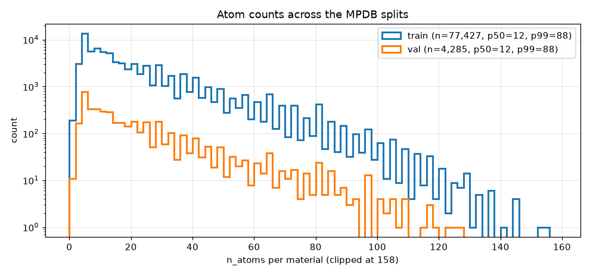
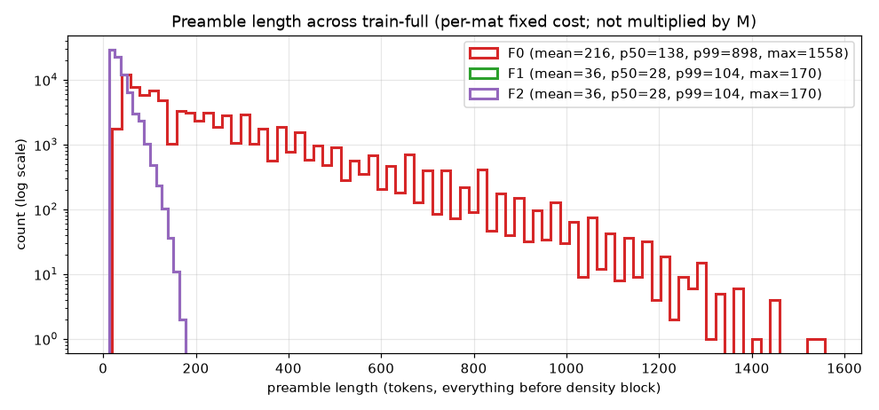
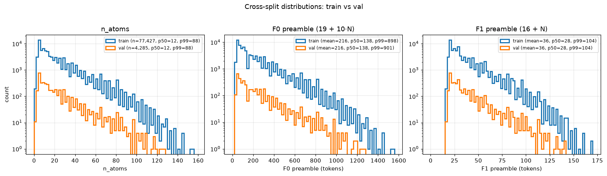

# Tokenization design space: P × F × M, with data

**Status**: pre-sweep planning

---

## Hook

We're about to fire 7 tokenization jobs to explore the (P, F, M) design
space — patch size × position-encoding style × patches-per-material. This
post audits the current tokenizer and pulls the actual MPDB statistics so
those 7 jobs are aimed by numbers, not vibes.

The three things that ended up surprising me:

1. **There is no in-row packing today.** One patch = one parquet row,
   padded to `ctx=8192`. Disk and "tokens-per-step" are both dominated by
   pad, not real content. Any P × F choice that materially changes
   preamble length only buys efficiency if we also shrink `pad_to` or
   start packing.
2. **F0's preamble is huge for big-N mats.** Median is 138 tokens, but
   **p99 is 898 tokens** (a 6× spread) — driven entirely by `10·n_atoms`.
   F1/F2 (one fused atom-emb token per atom) compress that to p50=28,
   p99=104.
3. **Patches are i.i.d.-uniform sampled with replacement.** M=64 today
   re-samples voxel positions with overlap; "M_max = full disjoint
   coverage" is a useful upper bound but not how the sampler works.

---

## 1. Current tokenizer audit (v3, LMQ density)

Code: `src/tomat/tokenizers/patch_v3.py`, sampling in
`scripts/tokenize_patches.py`.

### Preamble layout (default-shape patch, F0)

```
BOS                                       1
[GRID_START] nx ny nz [GRID_END]          5
[LATTICE_START] a b c α β γ [LATTICE_END] 8       # 0.05 Å / 0.2° quantization
[ATOMS_START] Z₁…Zₙ [ATOMS_END]           2 + N
[POS_START] (3 toks/coord × 3 axes)·N [POS_END]   2 + 9N
[DENS_START] LMQ_voxel × P³ [DENS_END]    2 + P³
EOS                                       1
─────────────────────────────────────────────────
total                                     21 + 10·N + P³
```

So **F0 preamble (everything before density tokens) = 19 + 10·N**, plus
`P³` density tokens plus 3 tail tokens (`DENS_START`, `DENS_END`, `EOS`).
(MPDB schema v3 fixed the `cube_seq_pN` virtual columns to use
`21 + 10·n_atoms + P³`; the v2-era stale formula was
`28 + 10·n_atoms + 2·P³` from the 2-token-9-12 density codec + extra
SHAPE/OFFSET/HI blocks all removed in v3.)

The position codec is `tomol_3byte` (3 tokens per fractional coord, 24-bit
log-uniform precision); density is the LMQ 1-token codec
(`gs://marin-eu-west4/tomat/codecs/lmq-v1.npz`, 16,384 bins).

### M selection: i.i.d. uniform, with replacement

`PatchTokenizer.random_offsets`:

```python
return np.stack([rng.integers(0, s, size=n) for s in grid_shape], axis=1)
```

That's it. **No deterministic stride, no disjoint sampling, no replacement
guard.** Each of M patches per mat is an independent uniform draw over
`[0, nx) × [0, ny) × [0, nz)`. Periodic-boundary `np.take(mode='wrap')`
means a patch can also wrap around. Two M=64 patches CAN cover the same
voxel; for P=19 on a (96×100×120) median mat, the per-voxel inclusion
probability is `M·P³ / N_voxels` ≈ 35% per epoch, so collisions are
significant but not pathological. Anything called "M_max" below is a
disjoint-stride upper bound, **not** what the sampler does.

### Sequence packing: none

`scripts/tokenize_patches.py:298–310`: each patch's token list is padded
with `[PAD]` up to `pad_to` (default 8192) and emitted as one parquet
row. Levanter consumes via
`PrebuiltLmDatasetFormat(input_ids_key="input_ids")` — one row, one
sequence, no concatenation across patches. Disk = `rows × pad_to × 4B`,
period.

This is the load-bearing fact for the whole packing analysis: today, the
"density-token efficiency" of any (P, F) is dictated by `pad_to` and not
by ctx.

---

## 2. Atom-count and preamble distributions

Source: `data/mpdb.sqlite`, 77,427 train mats with `n_atoms` populated
(plus 4,285 val).

**Atom counts** are heavily right-skewed:

| split |    n |  p1 | p10 | p50 | p90 | p99 |  max |
|-------|-----:|----:|----:|----:|----:|----:|-----:|
| train | 77,427 |   2 |   4 |  12 |  45 |  88 |  154 |
| val   |  4,285 |   2 |   4 |  12 |  44 |  88 |  126 |

Train and val have **identical** atom-count distributions through p99 —
no covariate shift on this axis. Median mat has 12 atoms; p99 has 88;
a long tail to 154. (No `test` split exists in MPDB — train + val only.)



**Preamble length** (tokens, per-mat — not multiplied by M; everything
**before** the density block):

|  F  |  mean |  p50 |  p90 |  p99 | p99.9 |   max |
|-----|------:|-----:|-----:|-----:|------:|------:|
| F0  | 215.8 |  138 |  468 |  898 |  1178 | 1,558 |
| F1  |  35.8 |   28 |   61 |  104 |   132 |   170 |
| F2  |  35.8 |   28 |   61 |  104 |   132 |   170 |

F1 (continuous sinusoidal, 1 fused atom-emb token per atom) and F2
(RoPE-3D at attention time) have **identical sequence length** — they
differ in how position information enters the model, not in how many
tokens the sequence has. From a packing / storage / data-cost
perspective they are the same; the rest of this post collapses F2 ≡ F1.



### Cross-split sanity check (train vs val)

The histograms repeat the train/val n_atoms + F0/F1 preamble side-by-side
to confirm no covariate shift on the axes this post cares about:

| split |  F  |  mean |  p50 |  p90 |  p99 | p99.9 |   max |
|-------|-----|------:|-----:|-----:|-----:|------:|------:|
| train | F0  | 215.8 |  138 |  468 |  898 |  1178 | 1,558 |
| train | F1  |  35.8 |   28 |   61 |  104 |   132 |   170 |
| val   | F0  | 216.0 |  138 |  458 |  901 |  1185 | 1,278 |
| val   | F1  |  35.8 |   28 |   60 |  104 |   132 |   142 |

Train and val match through p99.9; val's `max` is shorter only because
the val split contains 18× fewer mats and so the upper tail is sparser
(no val mat hits the absolute extreme `n_atoms=154` that the largest
train mat does). For sequence-budgeting at ctx=8192, the val
distribution is bracketed by the train statistics — no
distribution-shift risk in switching `pad_to` against train p99.



The F0 tail is what kills small-P packing: at p99, F0 spends **898
tokens** before a single density bin. F1 spends 104. The 6× spread is
entirely driven by the `10·N`-per-atom term; F0 emits 9 position-codec
tokens per atom (tomol's 3-byte scheme), F1 collapses that to 1.

---

## 3. Packing at ctx=8192 (using preamble p99)

We have to fit the **worst case** in a packed buffer — a single
"preamble too long" mat would otherwise overflow the row. Using p99 of
the preamble distribution:

|  P |  F | pre p99 | seq p99 | seqs/row | ρ-toks/row | ρ-efficiency |
|---:|----|--------:|--------:|---------:|-----------:|-------------:|
| 19 | F0 |     898 |   7,760 |        1 |      6,859 |        83.7% |
| 19 | F1 |     104 |   6,966 |        1 |      6,859 |        83.7% |
| 14 | F0 |     898 |   3,645 |        2 |      5,488 |        67.0% |
| 14 | F1 |     104 |   2,851 |        2 |      5,488 |        67.0% |
| 10 | F0 |     898 |   1,901 |        4 |      4,000 |        48.8% |
| 10 | F1 |     104 |   1,107 |        7 |      7,000 |        85.4% |
| 7  | F0 |     898 |   1,244 |        6 |      2,058 |        25.1% |
| 7  | F1 |     104 |     450 |       18 |      6,174 |        75.4% |

The phase transition is at P=10: **F0 makes small P pointless**, because
the preamble dominates each packed sub-sequence. F1 makes P=7 and P=10
both viable (75–85% efficiency vs F0's 25–49%).

Key reading: P=14 and P=19 packing is **F-insensitive** — even F0's
p99=898 leaves enough room for 1–2 seqs/row. So if the question is "can
we save context by switching to F1 at P=14 or P=19?", the answer at
ctx=8192 is "marginally": you'd save ~800 tokens on a 7,000-token row,
which doesn't change `seqs/row`.

**Today's regime (no packing).** Replace `seqs/row` with 1 everywhere
above and ρ-efficiency becomes `P³ / 8192`: 84% (P=19), 67% (P=14),
49% (P=10), 25% (P=7). The current 1-seq-per-row layout is **already
optimal for P=19/F0** and increasingly wasteful for smaller P. To
exploit small P we need to either (a) implement in-row packing or (b)
ship multiple `pad_to` variants (one per P).

---

## 4. M_max upper bound + storage / token budget

`M_max = floor(nx/P) · floor(ny/P) · floor(nz/P)` — disjoint-stride
patches on the **median train grid** (96×100×120). Quoted for the
median mat; the p1 mat is much smaller, so anchor-aligned disjoint
sampling there would yield fewer patches.

|  P | M_max (p50) | p1   | p99   |    max |
|---:|------------:|-----:|------:|-------:|
| 19 |         125 |    8 | 1,000 |  2,744 |
| 14 |         360 |   54 | 2,304 |  8,000 |
| 10 |       1,089 |  125 | 6,859 | 21,952 |
|  7 |       3,375 |  468 |19,683 | 64,000 |

**Voxel coverage per epoch on the median mat** (`M·P³ / N_voxels_med`):

|  P |  M     | coverage |
|---:|-------:|---------:|
| 19 |     64 |    34.8% |
| 19 |    125 |    68.0% |
| 14 |    180 |    39.2% |
| 14 |    360 |    78.4% |
| 10 |    544 |    43.2% |
| 10 |  1,089 |    86.4% |
|  7 |  1,687 |    45.9% |
|  7 |  3,375 |    91.9% |

(Coverage is on the median grid; the long tail of large mats sees
proportionally less.)

### Token + storage (F0, current encoding; pad_to=8192 today)

|  P | label          |     M |       n_seqs | real-toks | disk (padded) |
|---:|----------------|------:|-------------:|----------:|--------------:|
| 19 | M=64           |    64 |    4,955,328 |    34.7B |       162 GB |
| 19 | M=M_max=125    |   125 |    9,678,375 |    68.5B |       317 GB |
| 14 | M=64           |    64 |    4,955,328 |    14.7B |       162 GB |
| 14 | M=M_max=360    |   360 |   27,873,720 |    82.6B |       913 GB |
| 10 | M=64           |    64 |    4,955,328 |     6.0B |       162 GB |
| 10 | M=M_max=1089   | 1,089 |   84,318,003 |   102.8B |     2,763 GB |
|  7 | M=64           |    64 |    4,955,328 |     2.8B |       162 GB |
|  7 | M=M_max=3375   | 3,375 |  261,316,125 |   146.8B |     8,563 GB |

### With a snug `pad_to` per P (p99-fit, rounded up to next 64)

|  F |  P | pad_to | M     |       n_seqs | disk    |
|----|---:|-------:|------:|-------------:|--------:|
| F0 | 19 |  7,808 |    64 |    4.96M     | 155 GB  |
| F0 | 14 |  3,648 |   180 |   13.9M      | 203 GB  |
| F0 | 10 |  1,920 |   544 |   42.1M      | 323 GB  |
| F0 |  7 |  1,280 | 1,687 |  130.6M      | 669 GB  |
| F1 | 19 |  6,976 |    64 |    4.96M     | 138 GB  |
| F1 | 14 |  2,880 |   180 |   13.9M      | 161 GB  |
| F1 | 10 |  1,152 |   544 |   42.1M      | 194 GB  |
| F1 |  7 |    512 | 1,687 |  130.6M      | 268 GB  |

Cutting `pad_to` to the per-P p99 is the **first lever** before anything
else: it brings P=10/F0 from 2.8 TB → 323 GB while leaving the model's
view of each example unchanged. F1 compounds that by 1.2–2.5×.

---

## 5. Recommendation

Keep `train-full-v3` (P=19/F0/M=64) as control. Add **3 new t10n jobs**:

| codename     | P  | F   | M   | pad_to | disk     | rationale |
|--------------|----|-----|-----|-------:|---------:|-----------|
| v3-p14-m180  | 14 | F0  | 180 |  3,648 |  203 GB | direct P-ablation against v3; M chosen to roughly match v3's per-mat token budget. p50 voxel coverage 78% (vs 35% at v3) — should reduce free-running drift if patch-AR carries the local context. |
| v3-p10-f1-m544 | 10 | F1 | 544 | 1,152 |  194 GB | the cell where F1 actually unlocks new training regimes. p50 coverage 43% with 1B real-tokens-per-epoch / mat. Tests both small-P and the continuous atom encoding at once. |
| v3-p7-f1-m1687 | 7 | F1 | 1,687 |  512  | 268 GB | "tiny patch, huge M" — closest analogue to dense-pixel diffusion. ~92% voxel coverage at M_max; F1 is mandatory at this P (F0 would be 4.3 TB and 25% ρ-efficient if we ever packed). |

That's **3 jobs**, not 7. If 7 is the firm budget I'd add:

| extra        | P  | F   | M   | pad_to | disk     | rationale |
|--------------|----|-----|-----|-------:|---------:|-----------|
| v3-p19-f1-m64 | 19 | F1  | 64  | 6,976 |  138 GB | clean F0-vs-F1 ablation at the v3 control point; isolates atom-encoding effect from patch-size effect. |
| v3-p14-f1-m180 | 14 | F1 | 180 | 2,880 |  161 GB | matched pair against `v3-p14-m180` for the same ablation at P=14. |
| v3-p19-m125 | 19 | F0 | 125 | 7,808 |  309 GB | "M sweep at v3 control" — does doubling M actually double effective tokens-trained / voxel coverage given the i.i.d.-with-replacement sampling? p50 coverage 68% (vs 35%). |
| v3-p10-f0-m544 | 10 | F0 | 544 | 1,920 |  323 GB | F0 baseline at small-P; with snug pad_to the disk is fine even without F1. Tests whether small-P alone (without F1) helps. |

**Total disk for all 7 + control: ~1.6 TB.** Versus today's 162 GB for
just `train-full-v3`, this is ~10× the storage but enables four
ablation pairs that the current matrix can't answer.

### Skip / deprioritize

- **P=14 + F1 + small M** (e.g. M=64): F1 saves ~100 tokens per row at
  P=14 vs F0's ~900, but at M=64 the model is patch-coverage-limited,
  not preamble-limited. F1 should be paired with **larger M**, not
  smaller P.
- **Any "P × F0" cell at P ≤ 10 with packed multi-seq rows**: only 25–49%
  ρ-efficient; F1 dominates F0 at P ≤ 10 by every metric (storage,
  efficiency, voxel coverage per real token).
- **F2 as a separate t10n job**: identical sequence-level layout to F1
  (`19 + N + P³ + 2` tokens). It only changes attention math, so it can
  be tested by reusing F1 parquet and toggling a model-side flag — no
  new t10n run needed.

### Open questions for the t10n implementation

1. **Patch sampling**: should the new jobs continue with i.i.d.-uniform
   sampling, or switch to deterministic disjoint stride? The current
   scheme gives stochastic coverage with overlap; "M_max disjoint" gives
   determinism but loses the data-augmentation effect of shifted
   anchors. Probably worth a flag.
2. **`pad_to` snugging**: requires touching
   `scripts/tokenize_patches.py:298–310` to write per-P parquets at the
   right pad. Trivial.
3. **In-row packing**: not on the critical path for these 7 jobs, but
   the table in §3 shows it's the move that would make F1/P=7 a real
   regime change (18 seqs/row × 343 ρ-toks vs today's 1 seq/row × 343
   ρ-toks). Track as a separate spec.

---

## Appendix: reproduce

```
python scripts/analyze_t10n_design_space.py
# writes:
#   plots/posts/08/atoms_hist.png
#   plots/posts/08/preamble_hist.png
#   tmp/t10n_design_space.json
```

Numbers in this post are from MPDB at the schema version on disk in
`data/mpdb.sqlite` as of 2026-05-27 (77,427 train + 4,285 val mats).
